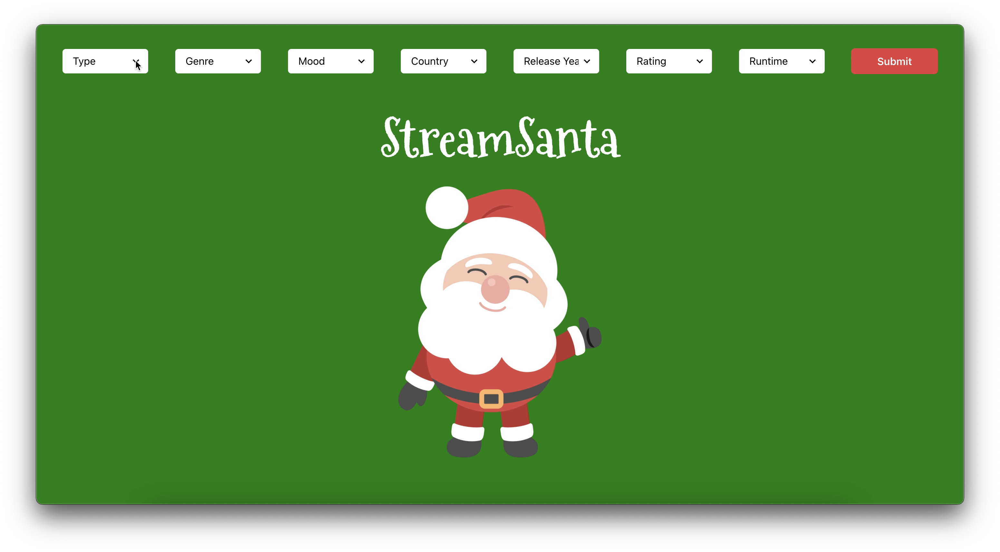

<div id="top"></div>
<!-- PROJECT LOGO -->
<br />
<div align="center">
  

  <h3 align="center">Stream Santa</h3>

  <p align="center">
    A web app that predicts the streaming service that your ideal movie will most likely be available on.
    <br />
    <br />
    <a href="https://github.com/jcdesmond23/jackdesmond.dev/issues">Report Bug</a>
  </p>
</div>


<!-- TABLE OF CONTENTS -->
<details>
  <summary>Table of Contents</summary>
  <ol>
    <li>
      <a href="#about-the-project">About The Project</a>
      <ul>
        <li><a href="#built-with">Built With</a></li>
      </ul>
    </li>
    <li>
      <a href="#getting-started">Getting Started</a>
      <ul>
        <li><a href="#installation">Installation</a></li>
      </ul>
    </li>
    <li><a href="#contributing">Contributing</a></li>
    <li><a href="#license">License</a></li>
    <li><a href="#contact">Contact</a></li>
    <li><a href="#acknowledgments">Acknowledgments</a></li>
  </ol>
</details>


<!-- ABOUT THE PROJECT -->
## About The Project



Stream Santa is web app built by me and 3 peers. The user describes their ideal movie that they would like to watch with their inputs and Stream Santa predicts the streaming service that they will mostly find this movie.

We use:
* IBM Watson AutoAI to build our model
* IBM Watson NLU to add mood datapoints for each movie in our training data

Stream Santa uses the React and Chakra UI libraries for the frontend and the backend is an Express REST API that controls communication from the frontend to both the deployed Watson AutoAI model and a Watson NLU service.

<p align="right">(<a href="#top">back to top</a>)</p>


### Built With

* [React.js](https://reactjs.org/)
* [Chakra UI](https://chakra-ui.com)
* [Express](https://expressjs.com)
* [IBM Watson](https://www.ibm.com/cloud)

<p align="right">(<a href="#top">back to top</a>)</p>


<!-- GETTING STARTED -->
## Getting Started

### Installation

1. Clone the repo
   ```sh
   git clone https://github.com/jcdesmond23/StreamSanta.git
   ```
2. Navigate to backend directory and install NPM packages
   ```sh
   npm install
   ```
3. Start the backend`
   ```sh
   npm start
   ```
4. Navigate to frontend directory and install NPM packages
   ```sh
   npm install
   ```
5. Start the frontend local host
   ```sh
   npm start
   ```

<p align="right">(<a href="#top">back to top</a>)</p>


<!-- CONTRIBUTING -->
## Contributing

Contributions are what make the open source community such an amazing place to learn, inspire, and create. Any contributions you make are **greatly appreciated**.

If you have a suggestion that would make this better, please fork the repo and create a pull request. You can also simply open an issue with the tag "enhancement".
Don't forget to give the project a star! Thanks again!

1. Fork the Project
2. Create your Feature Branch (`git checkout -b feature/AmazingFeature`)
3. Commit your Changes (`git commit -m 'Add some AmazingFeature'`)
4. Push to the Branch (`git push origin feature/AmazingFeature`)
5. Open a Pull Request

<p align="right">(<a href="#top">back to top</a>)</p>


<!-- LICENSE -->
## License

Distributed under the MIT License. See `LICENSE.txt` for more information.

<p align="right">(<a href="#top">back to top</a>)</p>


<!-- CONTACT -->
## Contact

Email: jackson.c.desmond.24@dartmouth.edu

<p align="right">(<a href="#top">back to top</a>)</p>


<!-- ACKNOWLEDGMENTS -->
## Acknowledgments

* [Chakra UI](https://chakra-ui.com)
* [Next.js](https://nextjs.org/)
* [React Icons](https://react-icons.github.io/react-icons/search)

<p align="right">(<a href="#top">back to top</a>)</p>
